# Model-Based Testing
 
 
In software testing, a model is a simpler way to describe the program under test.
A model holds some of the attributes of the program for which the model is built.
Given that the model preserves some of the original attributes of the system under test, it can be used to analyse and test the system.
 
Why should we use models at all? A model gives us a structured way to understand how the program operates (or should operate).
Model-based testing makes use of models of the system to derive tests.
 
In this chapter, we show what a model is (or can be), and go over some of the models used in software testing.
The two models covered in this chapter are decision tables and state machines.
 
 


 
 
## Decision Tables
 
Decision tables are used to model how a combination of conditions should lead to a certain action.
These tables are easy to understand and can be validated by the client for whom the software is created.
Developers can use the decision tables to derive tests that verify the correct implementation of the requirements with respect to the conditions.
 
### Creating decision tables
 
A decision table is a table containing the conditions and the actions performed by the system based on these conditions. In this section, we discuss how to build them.
 
In general, a decision table looks like the following:
 
<table>
  <tr><th></th><th></th><th colspan="4">Variants</th></tr>
  <tr><td rowspan="2"><br><i>Conditions</i></td>
      <td>&lt;Condition1&gt;</td><td>T</td><td>T</td><td>F<br></td><td>F</td></tr>
  <tr><td>&lt;Condition2&gt;</td><td>T<br></td><td>F</td><td>T</td><td>F</td></tr>
  <tr><td><i>Action</i></td><td>&lt;Action&gt;</td><td>value1<br></td><td>value2</td><td>value3</td><td>value4</td></tr>
</table>
 
This table contains all the combinations of conditions explicitly.
Later we will look at ways to reduce the number of combinations in the table and in this way reduce the cost of testing all the combinations.
 
The selected conditions should always be independent of each other.
Also, in this type of decision table, the order of the conditions does not matter, e.g., making `<Condition2>` true and `<Condition1>` false or making `<Condition1>` false and after that `<Condition2>` true, should result in the same outcome.
(If the order *does* matter in some way, a state machine might be a better model. We cover state machines later in this chapter.)
 
Let us devise a first concrete decision table for an example program.
 
> **Requirement: Phone Subscription**
> 
> When choosing a phone subscription, there are a couple of options you could choose.
> Depending on these options a price per month is given.
> We consider the two options: international services and automatic renewal.
> International services increase the price per month.
> Automatic renewal decreases the price per month.
 
In the decision table, international services and
automatic renewal will be turned into conditions.
True then corresponds to a chosen option and false
corresponds to an option that is not chosen.
 
 
The decision table is as follows:
 
<table>
  <tr><th></th><th></th><th colspan="4">Variants</th></tr>
  <tr><td rowspan="2"><br><i>Conditions</i></td>
      <td>International</td><td>F</td><td>F</td><td>T<br></td><td>T</td></tr>
  <tr><td>Auto-renewal</td><td>T<br></td><td>F</td><td>T</td><td>F</td></tr>
  <tr><td><i>Action</i></td><td>price/month</td><td>10<br></td><td>15</td><td>30</td><td>32</td></tr>
</table>
 
You can see the different prices for the combinations of international services and automatic renewal.
 
 
 
**Don't care values:** In some cases the value of a condition might not influence the action.
This is represented as a "don't care" value, or "dc".
 
Essentially, "dc" is a combination of two columns.
These two columns have the same values for the conditions and the same result, except the condition that had the dc value which has different values in the expanded form.
 
If the decision table is as follows:
 
<table>
  <tr><th></th><th></th><th colspan="3">Variants</th></tr>
  <tr><td rowspan="2"><br><i>Conditions</i></td>
      <td>&lt;Condition1&gt;</td><td>T</td><td>dc</td><td>F<br></td></tr>
  <tr><td>&lt;Condition2&gt;</td><td>dc</td><td>T</td><td>F</td></tr>
  <tr><td><i>Action</i></td><td>&lt;Action&gt;</td><td>value1<br></td><td>value1</td><td>value2</td></tr>
</table>
 
It can be expanded to:
 
<table>
  <tr><th></th><th></th><th colspan="5">Variants</th></tr>
  <tr><td rowspan="2"><br><i>Conditions</i></td>
      <td>&lt;Condition1&gt;</td><td>T</td><td>T</td><td>T<br></td><td>F</td><td>F</td></tr>
  <tr><td>&lt;Condition2&gt;</td><td>T<br></td><td>F</td><td>T</td><td>T</td><td>F</td></tr>
  <tr><td><i>Action</i></td><td>&lt;Action&gt;</td><td>value1<br></td><td>value1</td><td>value1</td><td>value1</td><td>value2</td></tr>
</table>
 
After expanding we can remove the duplicate columns.
We end up with the decision table below:
 
<table>
  <tr><th></th><th></th><th colspan="4">Variants</th></tr>
  <tr><td rowspan="2"><br><i>Conditions</i></td>
      <td>&lt;Condition1&gt;</td><td>T</td><td>T</td><td>F<br></td><td>F</td></tr>
  <tr><td>&lt;Condition2&gt;</td><td>T<br></td><td>F</td><td>T</td><td>F</td></tr>
  <tr><td><i>Action</i></td><td>&lt;Action&gt;</td><td>value1<br></td><td>value1</td><td>value1</td><td>value2</td></tr>
</table>
 
Let us now go back to the *Phone Subscription* example, and add another condition to it:
 
> A loyal customer receives the same discount as a
> customer who chooses the automatic renewal option.
> However, a customer is only entitled to the discount from one of the two options.
 
The new decision table is below:
 
<table>
  <tr><th></th><th></th><th colspan="6">Variants</th></tr>
  <tr><td rowspan="3"><br><i>Conditions</i></td>
      <td>International</td><td>F</td><td>F</td><td>F</td><td>T</td><td>T</td><td>T</td></tr>
  <tr><td>Auto-renewal</td><td>T</td><td>dc</td><td>F</td><td>T</td><td>dc</td><td>F</td></tr>
  <tr><td>Loyal</td><td>dc</td><td>T</td><td>F</td><td>dc</td><td>T</td><td>F</td></tr>
  <tr><td><i>Action</i></td><td>price/month</td><td>10</td><td>10</td><td>15</td><td>30</td><td>30</td><td>32</td></tr>
</table>
 
Note that when automatic renewal is true, the loyalty condition does not change the outcome and vice versa.
 
 
**Default behaviour**: Usually, $$N$$ conditions lead to $$2^N$$ combinations or columns.
However, the number of columns that are specified in the decision table can be smaller. Even if we expand all the dc values.
 
This is achieved by using a default action.
A default action means that if a combination of condition outcomes is not present in the decision table, the default action should be the result.
 
If we set the default charge rate to 10 per month the new decision table can be a bit smaller:
<table>
  <tr><th></th><th></th><th colspan="4">Variants</th></tr>
  <tr><td rowspan="3"><br><i>Conditions</i></td>
      <td>International</td><td>F</td><td>T</td><td>T</td><td>T</td></tr>
  <tr><td>Auto-renewal</td><td>F</td><td>T</td><td>dc</td><td>F</td></tr>
  <tr><td>Loyal</td><td>F</td><td>dc</td><td>T</td><td>F</td></tr>
  <tr><td><i>Action</i></td><td>price/month</td><td>15</td><td>30</td><td>30</td><td>32</td></tr>
</table>
 
 


 
 
### Testing decision tables
 
We can derive tests based on the decision tables, in such a way that we test whether the expected logic is implemented correctly.
There are multiple ways to derive tests for a decision table:
 
- **All explicit variants:** Derive a test case for each column. The number of tests equals the number of columns in the decision table.
- **All possible variants:** Derive a test case for each possible combination of condition values. For $$N$$ conditions this leads to $$2^N$$ test cases. Often, this approach is unrealistic because of the exponential relationship between the number of conditions and the number of test cases.
- **Every unique outcome / All decisions:** One test case for each unique outcome or action. The number of tests depends on the actions in the decision table.
- **Each condition T/F:** Make sure that each condition is true and false at least once in the test suite. This often results in two tests: all conditions true and all conditions false.
 
One more way to derive test cases from a decision table is by using the **Modified Condition / Decision Coverage (MC/DC)**.
This is a combination of the last two ways of deriving tests demonstrated above.
 
We have already discussed MC/DC in the Structural-Based Testing chapter.
MC/DC has the two characteristics of All decisions and Each condition T/F with an additional characteristic that makes MC/DC special:
 
1. Each condition is at least once true and once false in the test suite;
2. Each unique action should be tested at least once;
3. Each condition should individually determine the action or outcome.
 
The third point is achieved by making two test cases for each condition.
In these two test cases, the condition being tested should have a different value, the outcome should be different, and the other conditions should have the same value in both test cases.
With this the condition that is being tested individually influences the outcome, as the other conditions stay the same and therefore do not influence the outcome.
 
By choosing the test cases efficiently, MC/DC needs less tests than all variants, while still exercising the important parts of the system.
With fewer tests it will take less time to write the tests and the test suite will be executed quicker.
 
 
In order to derive the tests, we expand and rearrange the decision table of the *Phone Subscription* example as follows:
 
<table>
  <tr><th></th><th></th><th>v1</th><th>v2</th><th>v3</th><th>v4</th><th>v5</th><th>v6</th><th>v7</th><th>v8</th></tr>
  <tr><td rowspan="3"><br><i>Conditions</i></td>
      <td>International</td><td>T</td><td>T</td><td>T</td><td>T</td><td>F</td><td>F</td><td>F</td><td>F</td></tr>
  <tr><td>Auto-renewal</td><td>T</td><td>T</td><td>F</td><td>F</td><td>T</td><td>T</td><td>F</td><td>F</td></tr>
  <tr><td>Loyal</td><td>T</td><td>F</td><td>T</td><td>F</td><td>T</td><td>F</td><td>T</td><td>F</td></tr>
  <tr><td><i>Action</i></td><td>price/month</td><td>30</td><td>30</td><td>30</td><td>32</td><td>10</td><td>10</td><td>10</td><td>15</td></tr>
</table>
 
First, we look at the first condition (v1) and we try to find pairs of combinations that would cover this condition according to MC/DC.
We look for combinations where only International Services and the price/month change.
The possible pairs are: {v1, v5}, {v2, v6}, {v3, v7} and {v4, v8}.
<!-- TODO FM: What do we mean by this sentence? Is the sentence correctly formulated now?
 Before Marsha's change, this was "Testing both combinations of any of these pairs would give MC/DC for the first condition." -->
Testing both of the combinations in any of these pairs would give MC/DC for the first condition.
 
Then with Automatic Renewal we find these pairs: {v2, v4}, {v6, v8}.
For this condition {v1, v3} and {v5, v7} are not viable pairs, because both combinations of each pair involve the same action.
 
The last condition, Loyal, gives the following pairs: {v3, v4}, {v7, v8}.
 
By choosing the test cases efficiently we should be able to achieve full MC/DC by choosing four of the combinations.
We want to cover all the actions in the test suite.
Therefore, we need at least v4 and v8.
With these decisions we also have covered the International Services condition.
We need one of v1, v2, v3 and one of v5, v6, v7.
To cover Loyal we add v7 and to cover Automatic Renewal we add v2.
All the possible actions have now been covered.
 
For full MC/DC, we test the decisions: v2, v4, v7, v8.
 
 


 
 
### Implementing automated test cases for decision tables
 
Now that we know how to derive the test cases from the decision tables, it is time to implement them as automated test cases.
 
The most obvious way to test the combinations is to create a single test for each of the conditions.
Let us continue with the example for which we created the decision table earlier.
We write the tests for combinations v2 and v3.
Assuming that we can use some implemented methods in a `PhonePlan` class, the tests look like this:
 
```java
@Test
public void internationalAutoRenewalTest() {
  PhonePlan plan = new PhonePlan();
 
  plan.setInternational(true);
  plan.setAutoRenewal(true);
  plan.setLoyal(false);
 
  assertEquals(30, plan.pricePerMonth());
}
 
@Test
public void internationalLoyalTest() {
  PhonePlan plan = new PhonePlan();
 
  plan.setInternational(true);
  plan.setAutoRenewal(false);
  plan.setLoyal(true);
 
  assertEquals(30, plan.pricePerMonth());
}
```
 

Note that, in order to improve readability, we use setters to define whether a plan is for international services, automatic renewal or loyalty. The best way of designing the `PhonePlan` class would be to receive such parameters in the constructor.
This would force all clients of the class to provide these configurations at the moment of instantiation, preventing instances of `PhonePlan` to be in an inconsistent state.
 
We discuss more about such contracts in the design-by-contracts chapter.

 
 
In the example above, it should be noted that the different tests for the different combinations are similar.
The tests are the same but they operate on different values.
To avoid the code duplication that comes with this approach to implementing decision table tests, we can use parameterised tests (as we have done before):
 
```java
@ParameterizedTest
@CsvSource({
  "true, true, false, 30",   // v2
  "true, false, true, 30",   // v3
  "true, false, false, 32",  // v4
  "false, false, false, 15"  // v8
})
public void pricePerMonthTest(boolean international, boolean autoRenewal,
    boolean loyal, int price) {
  
  PhonePlan plan = new PhonePlan();
 
  plan.setInternational(international);
  plan.setAutoRenewal(autoRenewal);
  plan.setLoyal(loyal);
 
  assertEquals(price, plan.pricePerMonth());
}
```
 


 
### Non-binary choices and final guidelines
 

Write the video's accompanying text

 
 
 


 
 
 
 
## State Machines
 
A state machine is a model that describes the software system by describing its states.
A system often has multiple states and various transitions between these states.
The state machine model uses these states and transitions to illustrate the system's behaviour.
 
The main focus of a state machine is, as the name suggests, the states of a system.
So it is useful to think about what a state actually is.
The states in a state machine model describe where a program is in its execution.
If we need X to happen before we can do Y, we can use a state.
X would then cause the transition to this state.
From the state we can do Y, as we know that in this state X has already happened.
We can use as many states as we need to describe the system's behaviour well.
 
Besides states and transitions, a state machine has an initial state and events.
The initial state is the state that the system starts in.
From that state the system can transition to other states.
Each transition is paired with an event.
This event is usually one or two words that describe what has to happen to make the transition.
 
There are some agreements on how to make the models.
The notation we use is the Unified Modelling Language, UML.
For the state diagrams that means we use the following symbols:
 
- State: 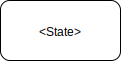
- Transition: 
- Event: 
- Initial state: 
 
For the following examples we model a (part of a) phone.
We start simply with a state machine that models the phone's ability to be locked or unlocked.
 
A phone that can be either locked or unlocked has two states: locked and unlocked.
Before there were face recognition and fingerprint sensors, you had to enter a password to unlock the phone.
A correct password unlocks the phone and if an incorrect password is given, the phone stays locked.
Finally, an unlocked phone can be locked again by pushing the lock button.
We can use these events in the state machine.
 
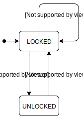
 
In the diagram the initial state is `LOCKED`.
Usually when someone starts using their phone, it is locked.
Therefore the initial state of the state machine should also be `LOCKED`.
 
 
 
Sometimes an event can lead to multiple states, depending on a certain condition.
To model this in the state machines, we use *conditional transitions*.
These transitions are only performed if the event happens and if the condition is true.
The conditions often depend on a certain value being used in the state machine.
To modify these values when a transition is taken in the state machine we use actions.
Actions are associated with a transition and are performed when the system uses that transition to go into another state.
The notation for conditions and actions is as follows:
 
- Conditional transition: 
- Action: 
 
 
When a user types the wrong password for four times in a row, the phone becomes blocked.
We use `n` in the model to represent the number of failed attempts.
Let us look at the conditional transitions that we need to model this behaviour.
 
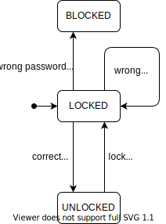
 
When `n` (the number of failed unlock attempts) is smaller than 3, the phone stays in `LOCKED` state.
However, when `n` is equal to 3, the phone goes to `BLOCKED`.
Here we have an event, wrong password, than can lead to different states based on the condition.
 
In the previous state machine, `n` never changes.
This means that the phone will never go to its `BLOCKED` state, as that requires `n` to be equal to 3.
We can add actions to the state machine to make `n` change correctly.
 
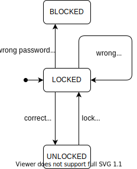
 
These added actions are to set `n` to `n+1` when an incorrect password is given and to 0 when a correct password is given.
This way the state machine will be in the `BLOCKED` state when a wrong password is given four times in a row.
 
 


 
 


 
 
### Testing state-machines
 
Like with the decision tables, we want to use the state machine model to derive tests for the software system.
 
First of all, we look at what might be implemented incorrectly.
An obvious potential error is a transition to the wrong state.
This will cause the system to act incorrectly, so we want the tests to catch such errors.
Additionally, the conditions in conditional transitions and the actions in transition can be wrong.
Finally, the behaviour of a state should stay the same at all times.
This means that moving from and to a state should not change the behaviour of that state.
 
For state machines, we have a couple of test coverages.
In this chapter we go over three main ways to define test coverage:
 
- **State coverage:** each state has to be reached at least once
- **Transition coverage:** each transition has to be exercised at least once
- **Paths:** not exactly a way of describing test coverage, but we use paths to derive test cases
 
To achieve the state coverage, we generally bring the system into a state through transitions and then assert that the system is in that state.
To test a single transition (for transition coverage), more steps are needed:
 
1. Bring the system into the state that the transition being tested goes out of;
2. Assert that the system is in that state;
3. Trigger the transition event;
4. If there is an action, check if this action has happened;
5. Assert that the system is in the new state that the transition points to.
 
 
To achieve full state coverage we need to arrive in each state once.
For the phone example we have three states so we can make three tests.
 
- Check that the system is `LOCKED` when it is started;
- Give the correct password and check that the system is `UNLOCKED`;
- Give an incorrect password four times and check that the system is `BLOCKED`.
 
With these three tests we achieve full state coverage, as the system is in each state at a certain point.
 
With the tests above, we have covered most of the transitions as well.
The only untested transition is the `lock button` from `UNLOCKED` to `LOCKED`.
To test this transition, we make the system `UNLOCKED` by giving the correct password.
Then we trigger the `lock button` and assert that the system is `LOCKED`.
 
 
### Paths and Transition trees
 
Besides the individual transitions, we can also test the combinations of transitions.
These combinations of transitions are called paths.
 
A logical thought might be: let's test all the paths in the state machine.
While this looks like a good objective, the number of paths will probably be too high.
Take a state machine that has a loop, i.e., a transition from state X to Y and a transition from state Y to X.
When creating paths we can keep going back and forth between these two states.
This leads to an infinite number of paths.
Obviously, we cannot test all the paths so we need to take a different approach.
 
The idea is that when using paths to derive test cases, we want each loop to be executed once.
This way we have a finite number of paths to be tested.
We derive these tests by using a transition tree, which spans the graph of the state machine.
Such a transition tree is created as follows:
 
1. The root node is the initial state of the state machine;
2. For each of the nodes at the lowest level of the transition tree:
  - If the state that the node corresponds to has not been covered before:
    For each of the outgoing transitions of this node's state:
      Add a child node that has the name of the state the transition points to. If this state is already in the tree, add or increment a number after the state's name to keep the node unique.
  - If any nodes were added: 
     Repeat from step 2. <!-- TODO: Marsha: this is already step 2. I find this whole point from point 1 not clear! -->
 
This is demonstrated in the example below.
 
To make the transition table more interesting, we modify the phone's state machine to have an `OFF` state instead of a `BLOCKED` state.
See the state machine below:
 
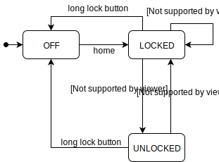
 
The root node of the transition tree is the initial state of the state machine.
We append a number to make it easier to distinguish this node from other nodes of the same state.
 
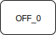
 
For each outgoing transition from the `OFF` state we add a child node to `OFF_0`.
 
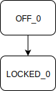
 
One node was added, so we continue by adding children to that node.
 
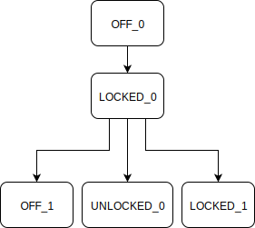
 
The only state we have not seen yet is `UNLOCKED` in the `UNLOCKED_0` node.
Therefore this is the only node we should add children to.
 
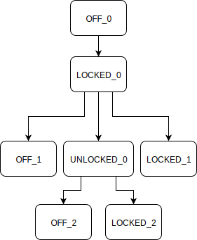
 
Now all the states of the nodes in the lowest layer have been visited so the transition tree is done.
 
 
 
From a complete transition tree, we can derive tests.
Each leaf node in the transition tree represents one path to test.
This path is shown by going from the root node to this leaf node.
In the tests, we assume that we are starting in the correct state.
Then, we trigger the next event that is needed for the given path and assume that we are in the next correct state.
These events that we need to trigger can be found in the state machine.
This process continues until the whole path has been followed.
 
 
In the transition tree of the previous example there are four leaf nodes: `OFF_1`, `OFF_2`, `LOCKED_1`, `LOCKED_2`.
We want a test for each of these leaf nodes, that follows the path leading to that node.
For `OFF_1` the test should 'move' the system from `OFF` to `LOCKED` and back to `OFF`.
Looking at the state machine this gives the events `home`, `long lock button`.
In the test we check that the system is `OFF`, then we trigger `home` and check that the system is `LOCKED`, then we trigger `long lock button` and assert that the system is `OFF`.
 
The tests for the other three paths can be derived in a similar fashion.
 
 
 
Using the transition tree, each loop that is in the state machine is executed once and while testing most of the important paths in the state machine, the number of tests is manageable.
 


 
 
### Sneak paths and transition tables
 
In the previous section, we discussed transition trees and how to use them to derive tests.
These tests check if the system behaves correctly when following different paths in the state machine.
With this way of testing, we check if the existing transitions in a state machine behave correctly.
However, we do not check whether there are any more transitions; transitions that should not be there.
We call these paths, "sneak paths".
 
A **sneak path** is a path in the state machine that should not exist.
So, for example, we have state X and Y and the system should not be able to transition directly from X to Y.
If the system can in some way transition directly from X to Y, we have a sneak path.
We need to test to see if such sneak paths exist in the system.
To achieve this, we make use of transition tables.
 
A transition table is a table containing each transition that is in the state machine.
The transition is given by the state it is going out of, the event that triggers the transition, and the state the transition goes to.
 
 
We construct a transition table as follows:
 
- List all the state machine's states along the rows;
- List all events along the columns;
- For each transition in the state machine note its destination state in the correct cell of the transition table.
 
 
We take a look at the same state machine for which we created a transition table:

 
To make the transition table we list all the states and events in the table:
 
<table>
  <tr>
    <td>STATES</td>
    <td colspan="5">Events</td>
  </tr>
  <tr>
    <td></td>
    <td>home</td>
    <td>wrong password</td>
    <td>correct password</td>
    <td>lock button</td>
    <td>long lock button</td>
  </tr>
  <tr>
    <td>OFF</td>
    <td></td>
    <td></td>
    <td></td>
    <td></td>
    <td></td>
  </tr>
  <tr>
    <td>LOCKED</td>
    <td></td>
    <td></td>
    <td></td>
    <td></td>
    <td></td>
  </tr>
  <tr>
    <td>UNLOCKED</td>
    <td></td>
    <td></td>
    <td></td>
    <td></td>
    <td></td>
  </tr>
</table>
 
Then we fill the table with the states that the transitions in the state machine point to:
 
<table>
  <tr>
    <td>STATES</td>
    <td colspan="5">Events</td>
  </tr>
  <tr>
    <td></td>
    <td>home</td>
    <td>wrong password</td>
    <td>correct password</td>
    <td>lock button</td>
    <td>long lock button</td>
  </tr>
  <tr>
    <td>OFF</td>
    <td>LOCKED</td>
    <td></td>
    <td></td>
    <td></td>
    <td></td>
  </tr>
  <tr>
    <td>LOCKED</td>
    <td></td>
    <td>LOCKED</td>
    <td>UNLOCKED</td>
    <td></td>
    <td>OFF</td>
  </tr>
  <tr>
    <td>UNLOCKED</td>
    <td></td>
    <td></td>
    <td></td>
    <td>LOCKED</td>
    <td>OFF</td>
  </tr>
</table>
 
We can see that there is, for example, a transition from `UNLOCKED` to `LOCKED` when the event `lock button` is triggered.
 
When we have the transition table, we have to decide the intended behaviour for the cells that are empty.
The default is to ignore the event and stay in the same state.
In some cases one might want the system to throw an exception.
These decisions depend on the project and the customer's needs.
 
As discussed earlier, we can use the transition table to derive tests for sneak paths.
Usually, we want the system to remain in its current state when we trigger an event that has an empty cell in the transition table.
To test for all possible sneak paths, we create a test case for each empty cell in the transition table.
First of all, the test will bring the system to the state corresponding to the empty cell's row (you can use the transition table to find a suitable path). Then the test triggers the event that corresponds to the empty cell's column. Finally the test asserts that the system is in the same state as before triggering the event.
The number of 'sneak path tests' is equal to the number of empty cells in the transition table.
 
With these tests we can verify both existing and non-existing paths.
Together these techniques produce a good testing suite from a state machine.
 


 
 
 
### Super states and regions
 
Up till now, we have looked at simple and small state machines.
When the modelled system becomes large and complex, it is typical for the state machine to develop in the same way.
At some point the state machine will consist of so many states and transitions, that it becomes unclear and impractical to manage.
To resolve this issue and make a state machine more scalable we use **super states** and **regions**.
 
**Super state**: A super state is a state that consists of a state machine.
Basically, we wrap a state machine in a super-state which is used as a state in another state machine.
 
The notation of the super-state is as follows:
 
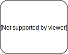
 
As a super state is, in essence, a state machine that can be used as a state, we know what should be inside the super state.
The super state generally consists of multiple states and transitions, and it always has to have an initial state.
Any transition going into the super state goes to the initial state of the super state.
A transition going out of the super state means that if the event on this transition is triggered in any of the super state's states, the system transitions into the state this transition points to.
 
We can choose to show the super state fully or we can collapse it.
A collapsed super state is just a normal state in the state machine.
This state has the super state's name and the same incoming and outgoing transitions as the super state.
 
With the super states and the collapsing of super states we can modularise and combine state machines.
This allows us to shift the state machine's focus to different parts of the system's behaviour.
 
 
We can use a super state even in the small example of a phone's state machine.
The two states `LOCKED` and `UNLOCKED` both represent the system in some sort of `ON` state.
We can use this to create a super state called `ON`.
 
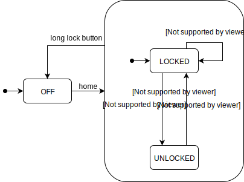
 
Now we can also simplify the state machine by collapsing the super state:
 
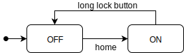
 
 
 
**Regions**:
So far we have had super states that contain one state machine.
Here, the system is in only one state of the super state at once.
In some cases it may be useful to allow the system to be in multiple states at once.
This is achieved with regions.
 
A super state can be split into multiple regions.
These are orthogonal regions, meaning that the state machines in the regions are independent from each other; they do not influence the state machines in other regions.
Each region contains one state machine.
When the system enters the super state, it enters all the initial states of the regions.
This means that the system is in multiple states at once.
 
The notation of regions is: 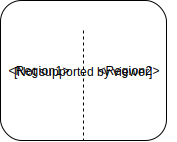
 
Expanding regions is possible, but is highly impractical and usually not wanted, because expanding a region requires the creation of a state for each combination of states in the different regions.
This causes the number of states and transitions to explode quickly.
For this reason, we will not cover how to expand regions.
 
In general it is best to use small state machines and to link these together using super states and regions.
 
So far when the phone was `ON` we modelled the `LOCKED` and `UNLOCKED` state.
When the phone is on, it drains the battery.
The system keeps track of the level of the battery.
Let's assume that our phone has two battery levels: low and normal.
The draining of the battery and the transitions between the states of the battery run in parallel to the phone being locked or unlocked.
With parallel behaviour like this, we can use the regions in the state machine model, which looks like the following, with the new battery states and the regions:
 
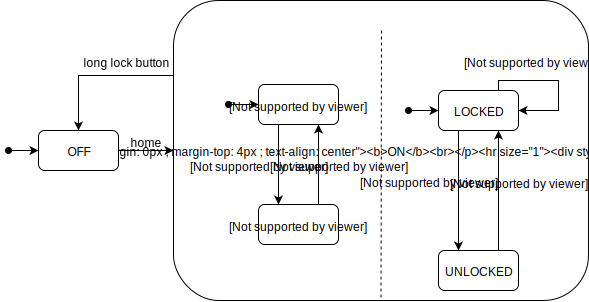
 
You see that we assume that the battery starts in the normal level state.
Therefore, when the system transitions to the `ON` state, it will be in both `LOCKED` and `NORMAL BATTERY` states at once.
 


 
 
 
### Implementing state-based testing in practice
 
You have now learnt a lot about state machines as a model.
One thing we have not looked at yet is how these state machines are represented in the actual code.
 
States are very common in programming.
Most classes in Object-Oriented-Programming correspond to their own small state machine.
 
In these classes, we distinguish two types of methods: **inspection** and **trigger** methods.
An **inspection** method only provides information about an object's state.
This information consists of the values or fields of an object.
The inspection methods only provide information. They do not change the state (or values) of an object.
**Trigger** methods bring the class into a new state.
This can be done by changing some of the class's values.
These trigger methods correspond to the events on the transitions in the state machine.
 
In a test, we want to bring the class to different states and assert that after each transition, the class is in the expected state.
In other words, a **test scenario** is basically a series of calls on the class's trigger methods.
Between these calls, we can call the inspection methods to check the state.
 
When a state machine corresponds to a single class, we can easily use the methods described above to test the state machine.
However, sometimes the state machine spans over multiple classes.
In that case, you might not be able to identify the inspection and trigger methods easily.
In this scenario, the state machines can even correspond to *end-to-end / system testing*.
Here, the flow of the entire system is under test, from input to output.
 
The system under test does not always provide a programming interface (API) to inspect the state or trigger the event for the transitions.
A common example of such a system is a web application.
In the end, the web application works through a browser.
To access the state or to trigger the transitions you would then need to use a dedicated tool, like [webdriver](https://webdriver.io/).
Using such a dedicated tool directly is not ideal, as you would have to specify each individual click on the web page to trigger events.
What we need is an abstraction layer on top of the system being tested.
This abstraction can be a Java class, with the methods that we need to be able to test the system as its state machine.
In this way, the abstraction layer will contain the inspection method to check the state and the trigger methods to perform the transitions.
 
With this small abstraction layer, we can formulate the tests clearly.
Triggering a transition is a single method call and checking the state also requires only one method call.
 
 
## Another example of a real-world model
 
Slack shared their internal flow chart that decides whether to send a notification of a message:
 
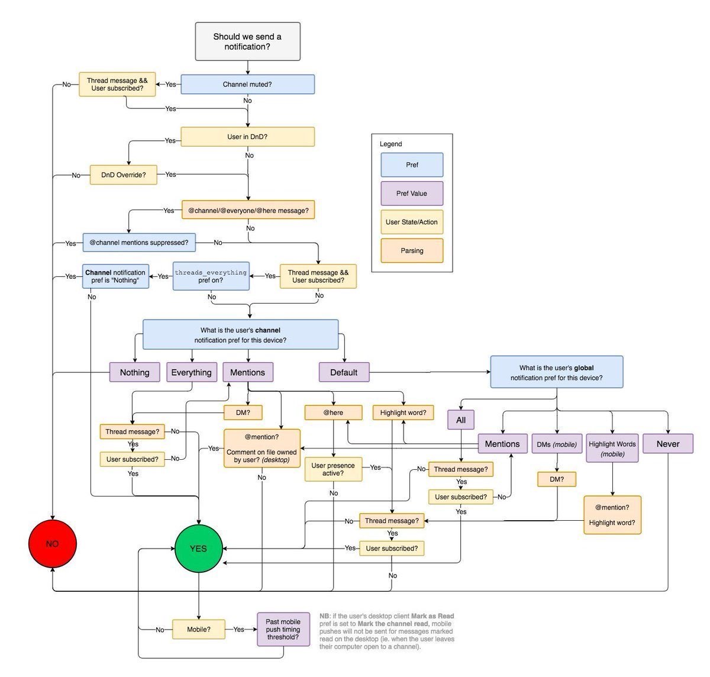
 
 
## Exercises
 
 
**Exercise 1.**
The *ColdHot* air conditioning system has the following requirements:
 
- When the user turns it on, the machine is in an *idle* state.
- If it is *too hot*, then, the *cooling* process starts. It goes back to *idle* when the defined *temperature is reached*.
- If it is *too cold*, then, the *heating* process starts. It goes back to *idle* when the defined *temperature is reached*.
- If the user *turns it off*, the machine is *off*. If the user *turns it on* again, the machine is back to *idle*.
 
Draw a minimal state machine to represent these requirements.
 
 
**Exercise 2.**
Derive the transition tree from the state machine of the assignment above.
 
 
**Exercise 3.**
Derive the transition table of the *ColdHot* state machine.
 
How many sneaky paths can be tested based on this transition table?
 
 
**Exercise 4.**
Draw the transition tree of the following state machine:
 
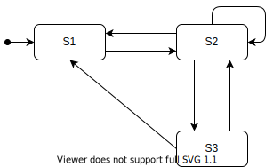
 
Use sensible naming for the states in your transition tree.
 
 
**Exercise 5.**
With the transition tree you devised in the previous exercise and the state machine in that exercise, what is the transition coverage of a test that the following events: [order placed, order received, order fulfilled, order delivered]?
 
 
**Exercise 6.**
Devise the decision table of the state machine that was given in the exercise above.
Ignore the initial transition `Order placed`.
 
 
**Exercise 7.**
How many sneak paths are there in the state machine we used in the previous exercises?
Again ignore the initial `Order placed` transition.
 
 
**Exercise 8.**
Consider the following decision table:
<table>
  <tr><th>Criteria</th><th colspan="6">Options</th></tr>
  <tr><td>C1: Employed for 1 year</td><td>T</td><td>F</td><td>F</td><td>T</td><td>T</td><td>T</td></tr>
  <tr><td>C2: Achieved last year's goal</td><td>T</td><td>dc</td><td>dc</td><td>F</td><td>T</td><td>F</td></tr>
  <tr><td>C3: Positive evaluation from peers</td><td>T</td><td>F</td><td>T</td><td>F</td><td>F</td><td>T</td></tr>
  <tr><td></td><td>10%</td><td>0%</td><td>5%</td><td>2%</td><td>6%</td><td>3%</td></tr>
</table>
 
Which decision do we have to test for full MC/DC?
 
Use as few decisions as possible.
 
 
 
 
**Exercise 9.**
See the following generic state machine.
 

 
Draw the transition tree of this state machine.
 
 
 
 
 
 
 
**Exercise 10.**
The advertisement (ad) feature is an important source of income for the company. Because of that, the life cycle of an ad needs to be better modelled.
Our product team defined the following rules:
 
* The life cycle of an ad starts with an 'empty' ad being created.
* The company provides information about the ad. More specifically, the company defines an image, a description, and how many times it should appear. When all this information is set, the ad then needs to wait for approval.
* An administrator checks the content of the ad. If it follows all the rules, the ad then waits for payment. If the ad contains anything illegal, it then goes back to the beginning of the process.
* As soon as the company makes the payment, the ad becomes available to users.
* When the target number of visualisations is reached, the ad is considered done. At this time, the company might consider running the campaign again, which moves the ad to wait for payment again. The company might also decide to end the campaign at that moment, which puts the ad in a final state.  
* While appearing for the users, if more than 10\% of the users complain about the ad, the ad is then marked as blocked. Cute Babies then gets in contact with the company. After understanding the case, the ad either starts to appear again, or is labelled as inappropriate. An inappropriate ad will never be shown again.
 
Devise a state diagram that describes the life cycle of an ad.
 
 
**Exercise 11.**
A microwave oven has the following requirements:
 
* Its initial state is `OFF`.
* When the user `turns it on`, the machine goes to an `ON` state.
* If the user selects `warm meal`, then, the `WARMING` process starts. It goes back to `ON` when the defined `time is reached`. A user may `cancel` it at any time, taking the microwave back to the `ON` state.
* If the user selects `defrost meal`, then, the `DEFROSTING` process starts. It goes back to `ON` when the defined `time is reached`. A user may `cancel` it at any time, taking the microwave back to the `ON` state.
* The user can `turn off` the microwave (after which it is `OFF`), but only if the microwave is not warming up or defrosting food.
 
Draw a minimal state machine to represent the requirements. For this question do not make use of super (OR) states.
Also, remember that, if a transition is not specified in the requirements, it simply does not exist, and thus, should not be represented in the state machine.
 
 
**Exercise 12.**
Devise a state transition tree for the microwave state machine.
 
**Exercise 13.**
Again consider the state machine requirements for the microwave.
There appears to be some redundancy in the defrosting and warming up functionality, which potentially can be described using super states (also called OR-states).
Which effect does this have on the total number of states and transitions for the resulting diagram with a super state?
 
1. There will be one extra state, and two less transitions.
2. There will be one state less, and the same number of transitions.
3. The total number of states will remain the same, and there will be two less transitions.
4. This has no effect on the total number of states and transitions.
 
 
 
**Exercise 14.**
See the requirement below:
 
```
Stefan works for Foodgram, a piece of software that enables users to send pictures of the dishes they prepare themselves. Foodgram's upload system has specific rules:
 
* The software should only accept images in JPG format.
* The software should not accept images that are bigger than 20MB.
* The software accepts images in both high and low resolution.
 
As soon as a user uploads a photo, the aforementioned rules are applied.
The software then either says *"Congratulations! Your picture was uploaded successfully"*, or *"Ooops, something went wrong!"*" (without any specific details about why it happened).
```
 
Create a decision table that takes the three conditions and their respective outcomes into account.
 
*Note: conditions should be modelled as Boolean decisions.*
 
 
 
 
 
 
 
 
 
**Exercise 15**
Twitter is a software system that enables users to share short messages with their friends.
Twitter's revenue model is ultimately based on advertisements ("ads").
Twitter's system needs to decide when to show ads to its users, and which ones. For a given user a given ad can be *highly-relevant*, and the system seeks to serve the most relevant ads as often as possible without scaring users away.
 
To that end, assume that the system employs the following rules to decide whether a user *U* gets served an ad *A* at the moment user *U* opens their Twitter app:
 
* If the user *U* has not been active during the past two weeks, she will not get to see add *A*;
* If the user *U* has already been served an ad during her last hour of activity, she will not get to see ad *A*;
* Furthermore, if the user *U* has over 1000 followers (an influencer), she will only get to see ad *A* if *A* is labelled as *highly-relevant* for *U*. Otherwise, user *U* will see *A* even if it is not *highly-relevant*.
 
We can model this procedure in a decision table, in various ways.
The complete table would have four conditions and 16 variants. We will try to create a more compact decision table. Note: We will use Boolean conditions only.
 
One way is to focus on the positive cases only, i.e., specify only the variants in which ad *A* is being served to user *U*. If you do not use 'DC' (don't care) values, how will the decision table look?
 
 
 
 
## References
 
* Chapter 4 of the Foundations of software testing: ISTQB certification. Graham, Dorothy, Erik Van Veenendaal, and Isabel Evans, Cengage Learning EMEA, 2008.
