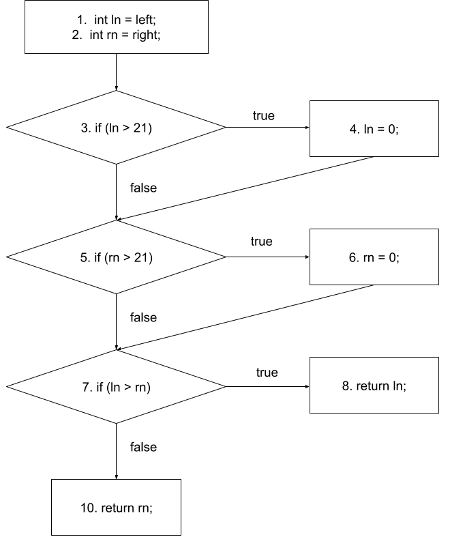

# Structural Testing

In a previous chapter, we discussed how to test software using requirements as the main element to guide the testing. 
In this chapter, we will use the source code itself as a source of information to create tests. 
Techniques that use the structure of the source code as a way to guide the testing, are called **structural testing** techniques.


Understanding structural testing techniques means understanding the different *coverage criteria*. These coverage criteria relate closely to *test coverage*, a concept that many developers know. By test coverage, we mean the amount (or percentage) of production code that is exercised by the tests.

We will cover the following coverage criteria:

- Line coverage (and statement coverage)
- Block coverage
- Branch/Decision coverage
- Condition (Basic and Condition+Branch) coverage
- Path coverage
- MC/DC coverage

Watch a summary of one of our lectures in structural testing:




## Why do we need structural testing?

In a nutshell, for two reasons: 1) to systematically
derive tests from source code, 2) to know when to stop testing.

As a tester, when performing specification-based testing, 
your goal was clear: to derive classes out of the requirement specifications, and then to derive test cases for each of the
classes. You were satisfied once all the classes and boundaries
were systematically exercised.

The same idea applies to structural testing. First, it gives
us a systematic way to devise tests. As we will see, a tester
might focus on testing all the lines of a program; or focus
on the branches and conditions of the program. Different
criteria produce different test cases. 

Second, to know
when to stop. It is easy to imagine that the number of possible paths in a mildly complex piece of code is just too large, and exhaustive testing is impossible. Therefore, having clear criteria on when to stop helps testers in understanding
the costs of their testing.


## Line (and statement) coverage

As the name suggests, when determining the line coverage, we look at the number of lines of code that are covered by the tests (more specifically,
by at least one test).

See the following example: 

> **Requirement**: Black-jack
>
> The program receives the number of points of two black jack players.
> The program must return the number of points of the winner.
> In blackjack, whoever gets closer to 21 points wins. 
> If a player goes over 21 points,
> the player loses. If both players lose, the program must return 0.

See the following implementation for the requirement above:

```java
public class BlackJack {
  public int play(int left, int right) {
1.  int ln = left;
2.  int rn = right;
3.  if (ln > 21)
4.    ln = 0;
5.  if (rn > 21)
6.    rn = 0;
7.  if (ln > rn)
8.    return ln;
9.  else
10.   return rn;
  }
}
```

Let us now devise and implement two test cases for this method:

```java
public class BlackJackTests {
  @Test
  void bothPlayersGoTooHigh() {
    int result = new BlackJack().play(30, 30);
    assertThat(result).isEqualTo(0);
  }

  @Test
  void leftPlayerWins() {
    int result = new BlackJack().play(10, 9);
    assertThat(result).isEqualTo(10);
  }
}
```

The first test executes lines 1-7, 9, and 10 as both values are higher than 21.
This means that, after the `bothPlayersGoTooHigh` test, 9 out of the 10 lines are covered. Thus, line coverage is $$\frac{9}{10}\cdot100\% = 90\%$$.

Line 8 is therefore the only line that the first test does not cover.
The second test, `leftPlayerWins`, complements the first test, and executes lines 1-3, 5, 7 and 8.
Both tests together now achieve a line coverage of $$100\%$$, as together they cover
all the 10 different lines of the program.

More formally, we can compute line coverage as: 

$$\text{line coverage} = \frac{\text{lines covered}}{\text{lines total}} \cdot 100\%$$






## Why is line coverage problematic?

Using lines of code as a way to determine line coverage is a simple and straightforward idea.
However, counting the covered lines is not always a good way of calculating the coverage.
The number of lines in a piece of code depends on the 
decisions taken by the programmer who writes the code. 

Let us look again at the Black Jack example.
The `play` method can also be written in 6 lines, instead of 10:

```java
public int play(int left, int right) {
1.  int ln = left;
2.  int rn = right;
3.  if (ln > 21) ln = 0;
4.  if (rn > 21) rn = 0;
5.  if (ln > rn) return ln;
6.  else return rn;
}
```

The `leftPlayerWins` test covered $$\frac{6}{10}$$ lines in the previous
implementation of the `play` method.
In this new implementation, it covers lines 1-5, or $$\frac{5}{6}$$ lines.
The line coverage went up from $$60\%$$ to $$83\%$$, 
while testing the same method with the same input.

This urges for a better representation of source code. One that is 
independent of the developers' personal code styles.


Some coverage tools measure coverage as statement level. Statements are the unique instructions that your
JVM, for example, executes. This is a bit better, as splitting one line of code in two would not make a difference, but it is still not good enough.






## Blocks and Control-Flow Graph

A **control-flow graph** (or CFG) is a representation of all paths that might be traversed during the execution of a piece of code. 
It consists of *basic blocks*, *decision blocks*, and *arrows/edges* that connect these blocks.

Let us use the Black Jack implementation to illustrate the difference between them:

```java
public class BlackJack {
  public int play(int left, int right) {
1.  int ln = left;
2.  int rn = right;
3.  if (ln > 21)
4.    ln = 0;
5.  if (rn > 21)
6.    rn = 0;
7.  if (ln > rn)
8.    return ln;
9.  else
10.   return rn;
  }
}
```

A basic block is composed of "maximum number of statements that are executed together no matter what happens". In the code above, lines 1-2 are always executed together. Basic blocks are often represented by a square.

At this moment, our control-flow graph looks like the following:


A decision block, on the other hand, represents all the statements in the source
code that can create different branches. See line 3: `if (ln > 21)`. This `if`
statement creates a decision moment in the application: based on the condition, it is decided which code block will be executed next. Decision blocks are often represented by diamonds. This decision block happens right 
after the basic block we created above, and thus, they are connected by means of
an edge.


A basic block has always a single outgoing edge. A decision block, 
on the other hand, always has
two outgoing edges (indicating where you go in case of the decision being evaluated to `true`, and where you go in case the decision is evaluated to `false`).

In case of the decision block being evaluated to `true`, line 4 is executed, and the
program continues to line 5.
Otherwise, it proceeds straight to line 5, which is another decision block:


When you repeat the approach up to the end of the program, you end up with the
following CFG:



Let us see an example of a more complex CFG:

> **Requirement**: Counting words
>
> Given a sentence, the program should count the number of words 
> that end with either an "s" or an "r".
> A word ends when a non-letter appears.

A possible implementation for this program is:

```java
public class CountLetters {
  public int count(String str) {
1.  int words = 0;
2.  char last = ' ';
3.  for (int i = 0; i < str.length(); i++) {
4.    if (!Character.isLetter(str.charAt(i))
5.        && (last == 's' || last == 'r')) {
6.      words++;
7.    }
8.    last = str.charAt(i);
9.  }
10. if (last == 'r' || last == 's')
11.   words++;
12. return words;
  }
}
```

The corresponding CFG:


Note that we split the `for` loop into three blocks: the variable initialisation, the decision block, and the increment.


As you can see, this CFG representation is quite generic. Even when you use a different programming language to write the same program, you might end up with the same CFG.


## Block coverage

We can use the control-flow graph to derive tests.
A first idea would be to use *blocks* as a coverage criterion, in the same way we did with lines, but instead of aiming at covering
100% of the lines, we aim at covering 100% of the blocks.

The formula that measures block coverage is similar to
the line coverage formula:

$$\text{block coverage} = \frac{\text{blocks covered}}{\text{blocks total}} \cdot 100\%$$

Note that blocks do not depend on how the developer wrote the code. Thus, it does not suffer from
having different coverage numbers due to different
programming styles.

For the `CountLetters` program, a test T1 = "cats and dogs" exercises all the blocks, and thus,
reaches 100% block coverage (follow the input in the control-flow graph and see all the blocks being executed):

```java
@Test
void multipleWords() {
  int words = new CountLetters().count("cats|dogs");
  assertEquals(2, words);
}
```


## Branch/Decision coverage

Complex programs often rely on lots of complex conditions (e.g., `if` statements composed of many conditions).
When testing these programs, aiming at 100% line or block coverage might not be enough to cover all the cases we want.
We need a stronger criterion.

Branch coverage (or decision coverage) works similar to line and statement coverage, except with branch coverage we count (or aim at covering) all the possible decision outcomes.


A test suite will achieve 100% branch (or decision) coverage when tests exercise all the possible outcomes of decision blocks:

$$\text{branch coverage} = \frac{\text{decision outcomes covered}}{\text{decision outcomes total}} \cdot 100\%$$

Decisions (or branches) are easy to identify in a CFG. 
Arrows with either `true` or `false` (i.e., both the arrows going out of a decision block) are branches, and therefore must be exercised.

Let's aim at 100% branch coverage for the Count Letter's `count` implementation above: 

```java
public class CountLettersTests {
  @Test
  void multipleMatchingWords() {

    int words = new CountLetters()
        .count("cats|dogs");

    assertEquals(2, words);
  }

  @Test
  void lastWordDoesntMatch() {

    int words = new CountLetters()
        .count("cats|dog");

    assertEquals(1, words);
  }
}
```

* The first test (by providing `cats|dogs` as input) covers all the branches in the left part of the CFG.
The right part covers the top `false` branch, because at some point `i` will be equal to `str.length()`.
The word "dogs" ends with an 's', so it also covers the `true` branch on the right side of the CFG.
This gives the test $$\frac{5}{6} \cdot 100\% = 83\%$$ branch coverage.

* The only branch that is now not covered is the `false` branch at the bottom right of the CFG.
This branch is executed when the last word does not end with an 'r' or an 's'.
The second test executes this branch, by providing the string `cats|dog` as input. Thus, the two tests together achieve a branch/decision coverage of $$100\%$$.


In the video, we use _squares_ to represent decision blocks. We did it just because otherwise the control-flow graph would not fit in the video. When doing control-flow graphs, please use _diamonds_ to represent decision blocks.






## (Basic) condition coverage

Branch coverage gives two branches for each decision, no matter how complicated or complex the decision is.
When a decision gets complicated, i.e., it contains more than one condition like `a > 10 && b < 20 && c < 10`, 
branch coverage might not be enough to test all the possible outcomes of all these decisions. 

For example, suppose one aims at testing the decision above.
A test T1 (a=20, b=10, c=5), which makes the condition `true`, and a test T2 (a=5, b=10, c=5), which makes the condition `false`, already fully cover this decision block, in terms of branch coverage. 
However, these two tests do not cover all the
possibilities/different combinations for this decision to be evaluated to `false`; e.g., T3 (a=20, b=30, c=5), etc.

When using *condition coverage* as a criterion, we split each compound condition into multiple decision blocks. This means each of the conditions will be tested separately, and not only the "big decision block".

It is common to then re-design the CFG and make sure each decision block is now composed of a single condition.
With the new CFG in hands (and with it new edges to explore), it works the same as branch coverage. The formula is basically the same, but now there are more decision outcomes to count:

$$\text{condition coverage} = \frac{\text{conditions outcome covered}}{\text{conditions outcome total}} \cdot 100\%$$

We achieve 100% condition coverage when all of the outcomes of
all the conditions in our program have been exercised.
In other words, whenever all the conditions have been `true` and `false` at least once.


Once again we look at the program that counts the words ending with an 'r or an 's'. Let us now focus on achieving 100% (basic) condition coverage.

We start by building a more granular CFG:


You can see that this new CFG has more decision blocks than the previous one (six instead of three).

The `multipleMatchingWords` test now covers 7 out of 12 different decision outcomes.
Condition coverage is thus $$\frac{7}{12} \cdot 100\% = 58\%$$.
This is significantly less than the $$83\%$$ branch coverage that we obtain from the same `multipleMatchingWords` test, 
showing how many more tests one would need 
to achieve 100% condition coverage.


## Condition + Branch coverage

Let's think carefully about condition coverage. If we only focus on exercising the individual conditions themselves, but do not
think of the overall decision, we might end up in a situation like the one below.

Imagine the following program and its respective CFG:

```java
void hello(int a, int b) {
  if(a > 10 && b > 20) {
    System.out.println("Hello");
  } else {
    System.out.println("Hi");
  }
}
```


A test `T1 = (20, 10)` causes the first condition `a > 10` to be `true`, and the
second condition `b > 20` to be `false`. A test `T2 = (5, 30)` makes the first condition `false`, and the second condition `true`. Note that T1 and T2 together achieve 100% **basic condition** coverage. After all, both conditions `a` and `b` have been exercised as both `true` and `false`. 

However, the final outcome of the entire decision was `false` in both tests. We never saw this program printing "Hello". We found a case where
we achieved 100% basic condition coverage, but only 50% branch coverage. This is not a smart testing strategy. This is why looking only at the conditions themselves while ignoring the overall outcome of the decision block is called
**basic condition coverage**.

In practice, whenever we use condition coverage, we actually perform **branch + condition coverage**. In other words, we make sure
that we achieve 100% condition coverage (i.e., all the outcomes of all conditions are exercised) and 100% branch coverage (all the outcomes
of the compound decisions are exercised).

From now on, whenever we mention **condition coverage**, we mean **condition + branch coverage**.






## Path coverage

With branch+condition coverage, we looked at each condition and branch individually. Such a criterion gives testers more branches to generate tests, especially when compared to the first criterion we discussed (line coverage).

However, although we are testing each condition to be evaluated as `true` and `false`, this does not ensure testing of *all the paths* that a program can have.

Path coverage does not consider the conditions individually. Rather, it considers the (full) combination of the conditions in a decision.
Each of these combinations is a path. You might see a path as a unique way to traverse the CFG.

The calculation is the same as the other coverages: 

$$\text{path coverage} = \frac{\text{paths covered}}{\text{paths total}} \cdot 100\%$$

See the following example that focus on a small piece of the `count` method:

```java
if (!Character.isLetter(str.charAt(i)) 
        && (last == 's' || last == 'r')) {
    words++;
}
```

The decision in this if-statement contains three conditions and can be generalised to `(A && (B || C))`, with:
* A = `!Character.isLetter(str.charAt(i))`
* B = `last == 's'`
* C = `last == 'r'`

To get $$100\%$$ path coverage, we would have to test all the possible combinations of these three conditions.

We make a truth table to find the combinations:

| Tests | A | B | C | Outcome |
|-------|---|---|---|---------|
| 1     | T | T | T | T       |
| 2     | T | T | F | T       |
| 3     | T | F | T | T       |
| 4     | T | F | F | F       |
| 5     | F | T | T | F       |
| 6     | F | T | F | F       |
| 7     | F | F | T | F       |
| 8     | F | F | F | F       |


This means that, for full path coverage, we would need 8 tests just to cover this `if` statement.
That is quite a lot for just a single statement.

By aiming at achieving path coverage of our program, testers can indeed come up with good tests.
However, the main issue is that achieving 100% path coverage might not always be feasible or too costly.
The number of tests needed for full path coverage will grow exponentially with the number of conditions in a decision.





## MC/DC (Modified Condition/Decision Coverage)

Modified condition/decision coverage (MC/DC) looks at the combinations of conditions like path coverage does.
However, instead of aiming at testing all the possible combinations, we follow a process in order to identify the "important" combinations. The goal of focusing on these important combinations is to manage the large number of test cases that one needs to devise when aiming for 100% path coverage.

The idea of MC/DC is to *exercise each condition 
in a way that it can, independently of the other conditions,
affect the outcome of the entire decision*. The example that is about to come will clarify it.

Cost-wise, a relevant characteristic of MC/DC coverage is that, supposing that conditions only have binary outcomes (i.e., `true` or `false`), the number of tests required to achieve 100% MC/DC coverage is $$N+1$$, where $$N$$ is the number of conditions in the decision. 
$$N+1$$ is definitely smaller than $$2^N$$!

Again, to devise a test suite that achieves 100% MC/DC coverage, we should devise $$N+1$$ test cases that, when combined, 
exercise all the combinations independently from the others.

The question is how to select such test cases. See the example below.

Let's test the decision block from the previous example, `(A && (B || C))`, with its corresponding truth table. Note how each row
represents a test $$T_n$$. In this case, tests go from 1 to 8, as we have 3 decisions, and $$2^3$$ is 8:

| Tests | A | B | C | Outcome |
|-------|---|---|---|---------|
| 1     | T | T | T | T       |
| 2     | T | T | F | T       |
| 3     | T | F | T | T       |
| 4     | T | F | F | F       |
| 5     | F | T | T | F       |
| 6     | F | T | F | F       |
| 7     | F | F | T | F       |
| 8     | F | F | F | F       |


Our goal will be to select $$N+1$$, in this case, $$3+1=4$$, tests.

Let us go condition by condition.
In this case, we start with selecting the pairs of combinations (or tests) for condition A:

* In test 1: A, B and C are all `true` and the outcome is `true` as well. We now look for another test in this table, where the value of A is flipped in comparison to test 1, but the others (B and C) are the same. In this case, we should look for a row where A=`false`, B=`true`, C=`true`. We find this in test 5. When we look at the outcome of test 5, we find it is `false`.

  This means we just found a pair of tests, $$T_1$$ and $$T_5$$, where A is the only condition that changed, and the outcome also changed. In other words, a pair of tests where A independently influences the outcome. Let's keep the pair $$\{T_1, T_5\}$$ in our list of tests.

* Now we look at the next test. In test 2, A is again `true`, B is `true`, and C is `false`. We repeat the process: we search for a test where A is flipped in comparison to test 2, but B and C are the same (B=`true`, C=`false`).

  We find this in test 6. The outcome from test 6 (`false`) is not the same as the outcome of test 2 (`true`), so this means that the pair of tests $$\{T_2, T_6\}$$ is also able to independently show how A can affect the final outcome.

* We repeat the process for test 3. We will find here that the pair $$\{T_3, T_7\}$$ also independently tests how the condition A affects the outcome.

* We repeat the process for test 4 (A=`true`, B=`false`, C=`false`). Its pair is test 8 (A=`false`, B=`false`, C=`false`). We note that the outcome of both tests is the same (`false`). This means that the pair $$\{T_4, T_8\}$$ does not show how A can independently affect the overall outcome; after all, A is the only thing that changes in these two tests, but the outcome is still the same.

* We do not find another suitable pair when we repeat the process for tests 5, 6, 7 and 8.

* Now that we have tested condition A, we move to condition B. We repeat the same process, but now we flip the input of B, and keep A and C the same.

* For $$T_1$$ (A=`true`, B=`true`, C=`true`), we search for a test where (A=`true`, B=`false`, C=`true`). We find test 3. However, the outcome is the same, so the pair $$\{T_1, T_3\}$$ does not show how B can independently affect the overall outcome.

* You will only find the pair $$\{T_2, T_4\}$$ for condition B.

* The final condition is C. There is only one pair of combinations that will work, which is $$\{T_3, T_4\}$$. (You should carry out the entire process to practise how the process works!)

* We now have all the pairs for each of the conditions:

  - A: {1, 5}, {2, 6}, {3, 7}
  - B: {2, 4}
  - C: {3, 4}

* To select the combinations that we want to test, we have to have at least one of the pairs for each condition (A, B, and C). We want to minimise the total number of tests, and we know for a fact that we can achieve this with $$N+1$$ tests.

* We do not have any choices with conditions B and C, as we only found one pair for each.
This means that we have to test combinations 2, 3, and 4.

* We need to find the appropriate pair of A. Note that any
of them would fit. However, we want to reduce the total amount
of tests in the test suite (and again, we know we only need 4 in this case).
To do so we can either add test 6 or test 7. 
We pick 6, randomly. You can indeed have more than one set of tests that achieves 100% MC/DC; all solutions are equally acceptable.

* Therefore, the tests that we need for 100% MC/DC coverage are {2, 3, 4, 6}.
These are the only 4 tests we need.
This is indeed cheaper when compared to the 8 tests we would need for path coverage.






## Loop boundary adequacy

In terms of coverage criteria, what to do when we have loops? When there is a loop, the block inside of the loop might be executed many times, making testing more complicated.

Think of a `while(true)` loop which can be non-terminating. If we wanted to be rigorous about it, we would have to test the program where the loop block is executed one time, two times, three times, etc. Imagine a `for(i = 0; i < 10; i++)` loop with a `break` inside of the body. We would have to test what happens if the loop body executes one time, two times, three times, ..., up to ten times.
It might be impossible to exhaustively test all the combinations.

How can we handle long lasting loops (a loop that runs for many iterations), or unbounded loops (where we do not know how many times it will be executed)? 

Given that exhaustive testing is impossible,
testers often rely on the **loop boundary adequacy criterion**
to decide when to stop testing a loop. A test suite satisfies this criterion if and only if for every loop:

* A test case exercises the loop zero times;
* A test case exercises the loop once;
* A test case exercises the loop multiple times.

The idea behind the criterion is to make sure the program
is tested when the loop is never executed (does the program
behave correctly when the loop is simply 'skipped'?), when it only iterates once (as we empirically know that algorithms may not handle single cases correctly), and many times.

Pragmatically speaking, the main challenge comes when devising
the test case for the loop being executed multiple times.
Should the test case force the loop to iterate for 2, 5, or 10 times?
That requires a good understanding of the program/requirement itself. 
Our suggestion for testers is to rely on specification-based techniques. With optimal understanding of the specs, one should be able to devise good tests for the particular loop.


## Criteria subsumption

You might have noticed that the criteria we studied became more rigorous and demanding throughout this chapter. We started our discussion with line coverage. Then we discussed branch coverage, and we noticed that we could generate more tests if we focused on branches. Then, we discussed branch + condition coverage, and we noticed that we could generate even more tests, if we also focused on the conditions.

There is a relationship between these criteria. Some strategies **subsume** other strategies. 
Formally, a strategy X subsumes strategy Y if all elements that Y exercises are also exercised by X. You can see in the figure below the relationship between the coverage criteria we studied.

<!--{width=50%}-->

For example, in the picture, one can see that branch coverage subsumes line coverage. This means that 100% of branch coverage always implies in 100% line coverage. However, 100% line coverage does not imply 100% branch coverage. Moreover, 100% of branch + condition coverage always implies 100% branch coverage and 100% line coverage.


## More examples of Control-Flow Graphs

We can devise control-flow graphs for programs in any programming language. For example, see the piece of
Python code below:

```python
# random_ads is a list of ads.
# an ad contains three attributes:
# * available: true/false indicating whether the ad 
#   is still available.
# * reached: true/false indicating 
#   whether the number of paid prints was reached.
# * prints: an integer indicating the 
#   number of times that the ad was printed.
def validate_ads(random_ads):
01. valid_ads = []
02. invalid_ads = []

03. for random_ad in random_ads:
04.   if random_ad.available and not random_ad.reached:
05.     valid_ads.append(random_ad)
06.   else:
07.     invalid_ads.append(random_ad)

08. for valid_ad in valid_ads:
09.   valid_ad.prints += 1

10. return valid_ads, invalid_ads
```

A CFG for this piece of code would look like:


We applied the same idea we have seen for Java programs in a Python program. The notions of basic and decision blocks are the same. A small difference to note is in the *foreach* loop (which is simply written using the `for` keyword in Python). Given that *foreach* loops do not follow the same format as traditional `for` loops, we modelled it differently: the *foreach* loop is fully represented by a single decision block (i.e., no blocks for the increment, or condition). As with any decision blocks, it has two outcomes, `true` and `false`.


## The effectiveness of structural testing

A common question among practitioners is whether
structural testing or, in their words, test coverage,
matters.

While researchers have not yet found a magical coverage
number that one should aim for, they have been finding
interesting evidence pointing towards the benefits
of performing structural testing.

We quote two of these studies:

* Hutchins et al.: "Within the limited domain of our experiments, test sets achieving coverage levels over 90% usually showed significantly better fault detection than randomly chosen test sets of the same size. In addition, significant improvements in the effectiveness of coverage-based tests usually occurred as coverage increased from 90% to 100%. However, the results also indicate that 100% code coverage alone is not a reliable indicator of the effectiveness of a test set."
* Namin and Andrews: "Our experiments indicate that coverage is sometimes correlated with effectiveness when [test suite] size is controlled for, and that using both size and coverage yields a more accurate prediction of effectiveness than [test suite] size alone. This in turn suggests that both size and coverage are important to test suite effectiveness."

For interested readers, a extensive literature review on the topic can be found in
Zhu, H., Hall, P. A., & May, J. H. (1997). Software unit test coverage and adequacy. ACM computing surveys (csur), 29(4), 366-427.


## Exercises

For the first couple of exercises we will use the following code:

```java
public boolean remove(Object o) {
01.  if (o == null) {
02.    for (Node<E> x = first; x != null; x = x.next) {
03.      if (x.item == null) {
04.        unlink(x);
05.        return true;
         }
       }
06.  } else {
07.    for (Node<E> x = first; x != null; x = x.next) {
08.      if (o.equals(x.item)) {
09.        unlink(x);
10.        return true;
         }
       }
     }
11.  return false;
}
```

This is the implementation of JDK8's LinkedList remove method. Source: [OpenJDK](http://hg.openjdk.java.net/jdk8/jdk8/jdk/file/687fd7c7986d/src/share/classes/java/util/LinkedList.java).

**Exercise 1.**
Give a test suite (i.e. a set of tests) that achieves $$100\%$$ **line** coverage on the `remove` method.
Use as few tests as possible.

The documentation on Java 8's LinkedList methods, that may be needed in the tests, can be found in its [Javadoc](https://devdocs.io/openjdk~8/java/util/linkedlist).


**Exercise 2.**
Create the control-flow graph (CFG) for the `remove` method.


**Exercise 3.**
Look at the CFG you just created. Which of the following sentences **is false**?

1. A minimal test suite that achieves 100% basic condition coverage has more test cases than a minimal test suite that achieves 100% branch coverage.

2. The method `unlink()` is for now treated as an 'atomic' operation, but also deserves specific test cases, as its implementation might also contain decision blocks.

3. A minimal test suite that achieves 100% branch coverage has the same number of test cases as a minimal test suite that achieves 100% full condition coverage.

4. There exists a single test case that, alone, is able to achieve more than 50% of line coverage.


**Exercise 4.**
Give a test suite (i.e. a set of tests) that achieves $$100\%$$ **branch** coverage on the `remove` method.
Use as few tests as possible.

The documentation on Java 8's LinkedList methods, that may be needed in the tests, can be found in its [Javadoc](https://devdocs.io/openjdk~8/java/util/linkedlist).


**Exercise 5.**
Consider the decision `(A or C) and B` with the corresponding decision table:

<table>
    <tr><th>Decision</th><th>A</th><th>B</th><th>C</th><th>(A | C) & B</th></tr>
    <tr><td>1</td><td>T</td><td>T</td><td>T</td><td>T</td></tr>
    <tr><td>2</td><td>T</td><td>T</td><td>F</td><td>T</td></tr>
    <tr><td>3</td><td>T</td><td>F</td><td>T</td><td>F</td></tr>
    <tr><td>4</td><td>T</td><td>F</td><td>F</td><td>F</td></tr>
    <tr><td>5</td><td>F</td><td>T</td><td>T</td><td>T</td></tr>
    <tr><td>6</td><td>F</td><td>T</td><td>F</td><td>F</td></tr>
    <tr><td>7</td><td>F</td><td>F</td><td>T</td><td>F</td></tr>
    <tr><td>8</td><td>F</td><td>F</td><td>F</td><td>F</td></tr>
</table>

What is the set with the minimum number of tests needed for $$100\%$$ MC/DC (Modified Condition / Decision Coverage)?


----

For the next three exercises use the code below.
This method returns the longest substring that appears at both the beginning and end of the string without overlapping.
For example, `sameEnds("abXab")` returns `"ab"`.

```java
public String sameEnds(String string) {
01. int length = string.length();
02. int half = length / 2;

03. String left = "";
04. String right = "";

05. int size = 0;
06. for (int i = 0; i < half; i++) {
07.   left = left + string.charAt(i);
08.   right = string.charAt(length - 1 - i) + right;

09.   if (left.equals(right)) {
10.     size = left.length();
      }
    }

11. return string.substring(0, size);
}
```

This code is based on the [same ends problem](https://codingbat.com/prob/p131516).

**Exercise 6.**
Draw the control-flow graph (CFG) of the source code above.


**Exercise 7.**
Give a test case (by the input string and expected output) that achieves 100% line coverage.


**Exercise 8.**
Given the source code of the `sameEnds` method. Which of the following statements is **not correct**?

1. It is possible to devise a single test case that achieves 100% line coverage and 100% decision coverage.
2. It is possible to devise a single test case that achieves 100% line coverage and 100% (basic) condition coverage.
3. It is possible to devise a single test case that achieves 100% line coverage and 100% decision + condition coverage.
4. It is possible to devise a single test case that achieves 100% line coverage and 100% path coverage.


----


Now consider this piece of code for the FizzBuzz problem.
Given an integer `n`, it returns the string form of the number followed by `"!"`.
So the integer 6 would yield `"6!"`.
Except if the number is divisible by 3 it returns "Fizz!" and if it is divisible by 5 it returns "Buzz!".
If the number is divisible by both 3 and 5 it returns "FizzBuzz!"
Based on a [CodingBat problem](https://codingbat.com/prob/p115243)

```java
public String fizzString(int n) {
1.  if (n % 3 == 0 && n % 5 == 0)
2.       return "FizzBuzz!";
3.  if (n % 3 == 0)
4.      return "Fizz!";
5.  if (n % 5 == 0)
6.      return "Buzz!";
7.  return n + "!";
}
```

**Exercise 9.**
Assume we have two test cases with an input integer: T1 = 15 and T2 = 8.

What is the condition coverage these test cases give combined?

What is the decision coverage?


----

The next couple of exercises use Java's implementation of the LinkedList's `computeIfPresent()` method.

```java
public V computeIfPresent(K key, BiFunction<? super K, ? super V, ? extends V> rf) {
01. if (rf == null) {
02.   throw new NullPointerException();
    }
  
03. Node<K,V> e;
04. V oldValue;
05. int hash = hash(key);
06. e = getNode(hash, key);
07. oldValue = e.value;
  
08. if (e != null && oldValue != null) {
  
09.   V v = rf.apply(key, oldValue);
  
10.   if (v != null) {
11.     e.value = v;
12.     afterNodeAccess(e);
13.     return v;
      }
      else {
14.     removeNode(hash, key, null, false, true);
      }
    }
15. return null;
}
```

**Exercise 10.**
Draw the control-flow graph (CFG) of the method above.


**Exercise 11.**
How many tests do we need **at least** to achieve $$100\%$$ line coverage?


**Exercise 12.**
How many tests do we need **at least** to achieve $$100\%$$ branch coverage?


**Exercise 13.**
Which of the following statements concerning the subsumption relations between test adequacy criteria **is true**:


1. MC/DC subsumes statement coverage.
2. Statement coverage subsumes branch coverage.
3. Branch coverage subsumes path coverage.
4. Basic condition coverage subsumes branch coverage.


**Exercise 14.**
A test suite satisfies the loop boundary adequacy
criterion if for every loop L:

1. Test cases iterate L zero times, once, and more than once.
2. Test cases iterate L once and more than once.
3. Test cases iterate L zero times and one time.
4. Test cases iterate L zero times, once, more than once, and N, where N is the maximum number of iterations.


**Exercise 15.**
Consider the expression `((A and B) or C)`.
If we aim to achieve 100\% *Modified Condition / Decision Coverage* (MC/DC), the **minimum** set of tests we should select is:

1. {2, 3, 4, 6}
2. {1, 3, 4, 6}
3. {2, 3, 5, 6}
4. {3, 4, 7, 8}


## References

* Chapter 4 of the Foundations of software testing: ISTQB certification. Graham, Dorothy, Erik Van Veenendaal, and Isabel Evans, Cengage Learning EMEA, 2008.

* Chapter 12 of the Software Testing and Analysis: Process, Principles, and Techniques. Mauro Pezzè, Michal Young, 1st edition, Wiley, 2007.

* Zhu, H., Hall, P. A., & May, J. H. (1997). Software unit test coverage and adequacy. ACM computing surveys (csur), 29(4), 366-427.

* Cem Kaner on Code Coverage: http://www.badsoftware.com/coverage.htm

* Arie van Deursen on Code Coverage: http://avandeursen.com/2013/11/19/test-coverage-not-for-managers/

* Hutchins, M., Foster, H., Goradia, T., & Ostrand, T. (1994, May). Experiments of the effectiveness of data flow-and control flow-based test adequacy criteria. In Proceedings of the 16th international conference on Software engineering (pp. 191-200). IEEE Computer Society Press.

* Namin, A. S., & Andrews, J. H. (2009, July). The influence of size and coverage on test suite effectiveness. In Proceedings of the eighteenth international symposium on Software testing and analysis (pp. 57-68). ACM.


